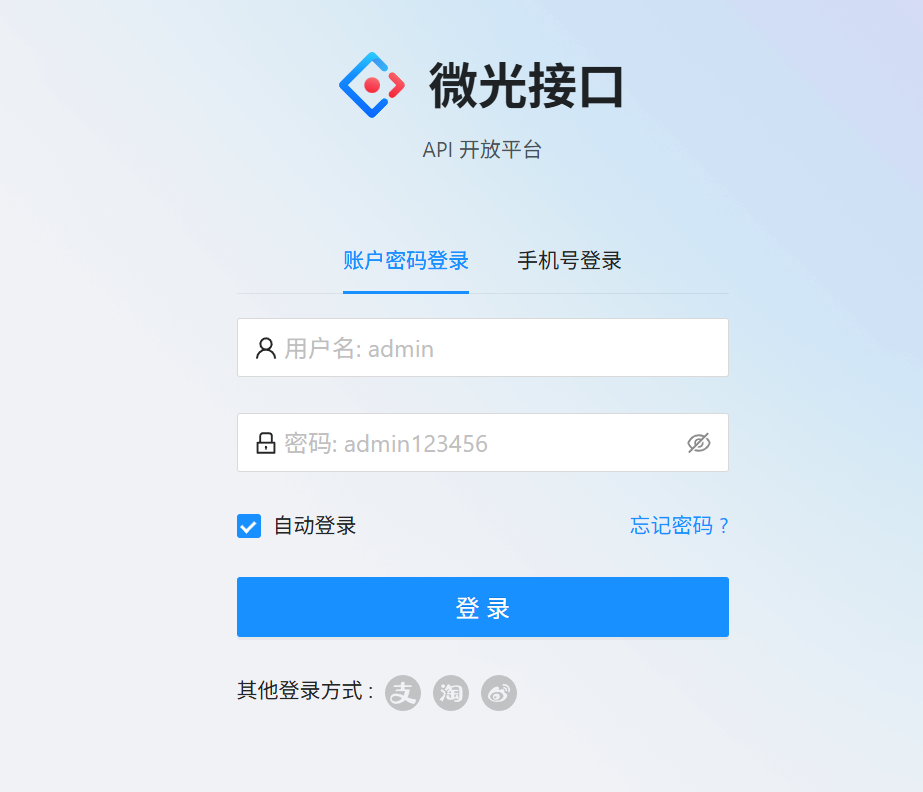
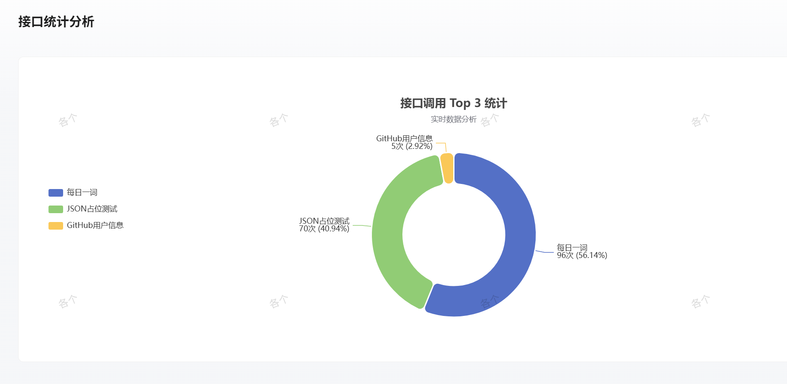

# 🚀 API 接口开放平台 (API-Backend)

> **一个高性能、高可用的分布式 API 调用与管理平台。**
>
> [](https://www.oracle.com/java/)
> [](https://spring.io/projects/spring-boot)
> [](https://dubbo.apache.org/zh/)
> [](LICENSE)

---

## 🔗 快速链接

- **[在线 Demo 访问]**：`http://129.211.30.74`
- **[后端代码仓库]**：`https://github.com/techsonnet/api-backend`
- **[前端代码仓库]**：`https://github.com/techsonnet/api-frontend`

---

## 📖 项目简介

本平台旨在为开发者提供一个**安全、稳定、极简**的接口调用环境。开发者可以通过平台在线调试接口，并利用我们提供的 **Spring Boot Starter SDK** 实现“一行代码”快速接入。

**核心解决痛点：**
1. **接口安全**：通过 AK/SK 签名验签机制，彻底解决接口被非法盗刷和数据篡改风险。
2. **流量治理**：集成 Redis 分布式限流，在网关层精准控制调用频率，保护核心业务逻辑。
3. **极简接入**：封装 Starter SDK，屏蔽复杂的签名计算逻辑，提升第三方开发者体验。

---

## 🛠️ 技术栈

### 后端架构
- **核心框架**：Spring Boot 2.7.x + Dubbo 3.0 (RPC)
- **注册中心**：Nacos 2.x (服务发现与配置管理)
- **网关安全**：Spring Cloud Gateway (动态路由、鉴权、日志、限流)
- **数据持久化**：MySQL 8.0 + MyBatis-Plus
- **中间件**：Redis 5.0 (原子计数器、分布式锁)

### 前端架构
- **核心框架**：React 18 + Ant Design Pro
- **脚手架工具**：UmiJS + Axios 封装
- **辅助手段**：AI-Assisted Coding (高效完成前端业务逻辑与前后端联调)

---

## ✨ 核心亮点

### 1. 生产环境性能调优 (Optimization) 🌟
项目针对 **2核4G** 低配服务器进行了深度的生产环境调优，实现了多组件（Nacos, MySQL, Redis, Backend, Gateway）的稳定共存：
- **JVM 深度优化**：弃用默认回收器，切换至 **G1 垃圾回收器**，并配置 `-Xms512m -Xmx1024m` 堆内存，平衡了内存占用与响应速度。
- **资源监控与隔离**：针对多实例部署时的 `mapping.cache` 冲突，实现了 Dubbo 元数据存储隔离，并通过 **Linux Swap** 机制确保高负载下的系统可用性。

### 2. 多重安全防护体系
- **AK/SK 签名验签**：基于 HmacSHA256 算法，结合 **Nonce (随机数)** 与 **Timestamp (时间戳)**，有效防止重放攻击。
- **网关统一鉴权**：在 Spring Cloud Gateway 层实现全局校验逻辑，解耦业务逻辑与安全逻辑。

### 3. 工程化 SDK 设计
- 独立封装 **api-client-sdk**，利用 Spring Boot 自动配置机制，开发者只需在 `yml` 配置 AK/SK 即可立即通过注入对象调用远程接口。

---

## 🖼️ 项目截图

> 
> *项目首页：展示接口列表与调用量统计*

> 
> *接口详情：支持在线调试与参数预览*

---

## 📦 快速启动

### 环境准备
- JDK 1.8+
- Nacos 2.x
- MySQL 8.0 / Redis 5.0+

### 本地部署
1. 克隆项目：`git clone https://github.com/xxx/api-backend.git`
2. 导入 `sql` 目录下的数据库脚本。
3. 修改 `application-prod.yml` 中的 Nacos 及数据库连接信息。
4. 编译打包：`mvn clean package -DskipTests`
5. 启动运行：
   ```bash
   nohup java -jar target/api-backend-0.0.1-SNAPSHOT.jar --spring.profiles.active=prod > output.log 2>&1 &
